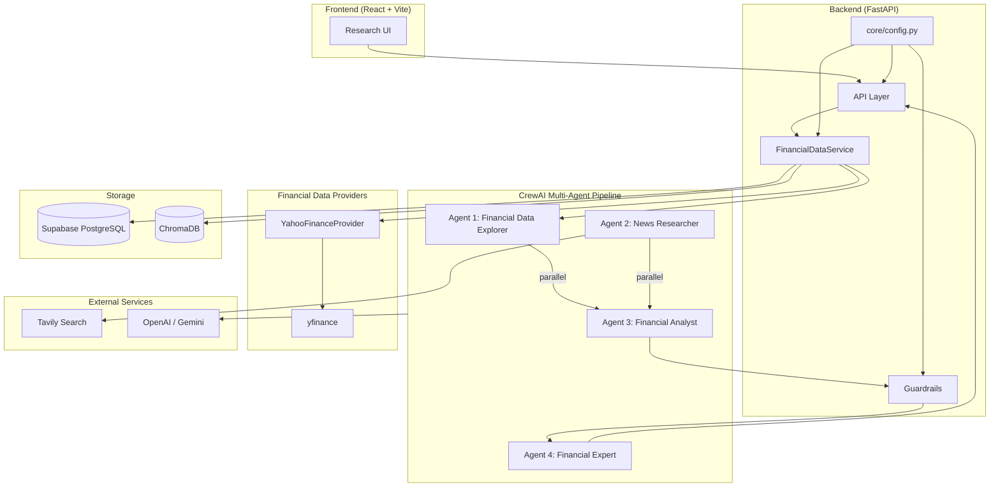
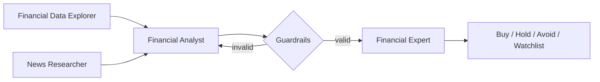

# InvestIQ

AI-powered investment research platform focused on **Indian equities**. Analyzes NSE/BSE-listed companies and generates institutional-quality research reports.

## Architecture Overview



### Data flow (financial layer)

```text
FastAPI route / CrewAI tool
    → FinancialDataService
    → YahooFinanceProvider
    → yfinance
    → Structured Pydantic response
```

Ticker normalization is automatic: `INFY` → `INFY.NS`, `RELIANCE` → `RELIANCE.NS`. Suffixes `.NS` and `.BO` are preserved.

### Agent Pipeline



| Agent | Role | Output |
|-------|------|--------|
| 1 – Financial Data Explorer | Gather structured financial data | Facts only, no opinions |
| 2 – News Researcher | Gather news, filings, sentiment | Qualitative context |
| 3 – Financial Analyst | Analyze fundamentals, valuation, risks | Investment thesis |
| 4 – Financial Expert | Final recommendation | Rating + confidence + reasoning |

Agents 1 and 2 run **in parallel**. Guardrails validate output before Agent 4 executes.

## Project Structure

```
InvestIQ/
├── backend/
│   ├── app/
│   │   ├── api/           # HTTP routes
│   │   ├── core/          # Centralized Pydantic Settings (config.py)
│   │   ├── providers/     # YahooFinanceProvider + future NSE/BSE/FMP providers
│   │   ├── agents/        # CrewAI agent definitions
│   │   ├── tasks/         # CrewAI tasks
│   │   ├── tools/         # CrewAI tools (call services, not yfinance directly)
│   │   ├── services/      # Business logic
│   │   ├── guardrails/    # Output validation
│   │   ├── schemas/       # Pydantic models
│   │   ├── config/        # Backward-compatible re-exports
│   │   ├── database/      # Supabase + ChromaDB
│   │   ├── models/        # Domain models
│   │   └── utils/         # Helpers
│   ├── database/migrations/
│   ├── tests/
│   └── requirements.txt
├── frontend/              # React + Vite + Tailwind
├── docs/DEPLOYMENT.md
├── render.yaml
└── README.md
```

## Development Roadmap

| Phase | Focus | Status |
|-------|-------|--------|
| **1** | Backend foundation – FastAPI, config, health check | ✅ Done |
| **2** | Financial data – Yahoo Finance provider for Indian equities | ✅ Done |
| **3** | CrewAI agents – 4-agent pipeline with parallel execution | ✅ Done |
| **4** | Guardrails – hallucination detection, staleness, conclusion validation | ✅ Done |
| **5** | Database – Supabase + ChromaDB for report storage/RAG | ✅ Done |
| **6** | Frontend – React research UI | ✅ Done |
| **7** | Deployment – Render (backend) + Vercel (frontend) | ✅ Ready |

## Getting Started

### Prerequisites

- Python 3.11+
- Node.js 20+ (for frontend)

### Backend Setup

```bash
cd backend
python -m venv .venv

# Windows
.venv\Scripts\activate

# macOS / Linux
source .venv/bin/activate

pip install -r requirements.txt
cp .env.example .env   # then fill in API keys
```

### Configuration

All environment variables are loaded through a single Pydantic Settings module:

```python
from app.core.config import settings
```

Config file: `backend/app/core/config.py`  
Env template: `backend/.env.example`

| Variable | Required for | Notes |
|----------|--------------|-------|
| `YFINANCE_ENABLED` | Financial data | Default `true` – no API key needed |
| `GEMINI_API_KEY` or `OPENAI_API_KEY` | Full AI reports | One LLM key is enough |
| `TAVILY_API_KEY` | News research (Agent 2) | Required for full pipeline |
| `SUPABASE_URL` + `SUPABASE_ANON_KEY` | Persistent report storage | Optional locally; in-memory fallback |
| `FMP_API_KEY` | — | Optional future provider; not used in MVP |

Run the server:

```bash
uvicorn app.main:app --reload --host 0.0.0.0 --port 8000
```

If port 8000 is blocked on Windows, use `--port 8001` and update `frontend/.env` accordingly.

### Verify

- Health check: http://localhost:8000/api/v1/health
- API docs: http://localhost:8000/docs

### Financial Data API (Indian equities)

```bash
# Compact summary – converts INFY → INFY.NS automatically
curl http://localhost:8000/api/v1/financials/INFY

# Full structured data
curl -X POST http://localhost:8000/api/v1/research/RELIANCE
```

Example tickers: `INFY`, `RELIANCE`, `TCS`, `HDFCBANK`, `ICICIBANK`, `SBIN` (all normalized to `.NS`).

Returns structured JSON: company profile, income statements, balance sheets, cash flow, ratios, key metrics, and market data. Facts only – no AI opinions.

### Full AI Research Report

```bash
# Requires GEMINI_API_KEY (or OPENAI_API_KEY) and TAVILY_API_KEY
curl -X POST http://localhost:8000/api/v1/research/INFY/report
```

Runs the full multi-agent pipeline: Agents 1 & 2 in parallel → Agent 3 analysis → guardrails → Agent 4 recommendation.

### Guardrails

The pipeline validates Agent 3 output before Agent 4 runs:

| Check | What it catches | Severity |
|-------|-----------------|----------|
| Completeness | Missing financial/news data | Error |
| Staleness | Old statements, outdated news | Error / Warning |
| Hallucinations | Numeric claims not in source data | Error |
| Conclusions | Buy/sell in analysis, contradictions | Error |
| Analysis quality | Too short, missing sections | Error / Warning |

Configurable via `.env`:

```env
GUARDRAIL_MAX_ANALYSIS_RETRIES=1
GUARDRAIL_STATEMENT_MAX_AGE_MONTHS=18
GUARDRAIL_NEWS_MAX_AGE_DAYS=30
GUARDRAIL_BLOCK_ON_WARNINGS=false
```

### Report Storage & RAG

Reports are auto-saved when `STORAGE_ENABLED=true`. Without Supabase credentials, an in-memory store is used for development.

```bash
# 1. Run migration in Supabase SQL Editor:
#    backend/database/migrations/001_research_reports.sql

# 2. Configure .env:
#    SUPABASE_URL=https://your-project.supabase.co
#    SUPABASE_ANON_KEY=your-anon-key

# List all reports
curl http://localhost:8000/api/v1/reports

# Get report by ID
curl http://localhost:8000/api/v1/reports/{report_id}

# Reports for a ticker
curl http://localhost:8000/api/v1/reports/ticker/INFY

# RAG – similar past reports (requires ChromaDB)
curl "http://localhost:8000/api/v1/reports/search/similar?query=infosys%20revenue%20growth&ticker=INFY"
```

### Frontend Setup

```bash
cd frontend
npm install
cp .env.example .env
# Set VITE_API_URL=http://localhost:8000/api/v1

npm run dev
```

Open http://localhost:5173

| Page | Route | Purpose |
|------|-------|---------|
| Research | `/` | Enter ticker, generate AI report |
| History | `/reports` | Browse saved reports |
| Report detail | `/reports/{id}` | Full report viewer |

### Deployment

Full step-by-step guide: **[docs/DEPLOYMENT.md](docs/DEPLOYMENT.md)**

Quick summary:

1. **Render** – deploy `backend/` (uses `render.yaml` at repo root)
2. **Vercel** – deploy `frontend/` with `VITE_API_URL=https://your-api.onrender.com/api/v1`
3. Set `CORS_ORIGINS` on Render to your Vercel URL
4. Set `SUPABASE_URL` and `SUPABASE_ANON_KEY` on Render for persistent storage

### Run Tests

```bash
cd backend
pytest -v
```

Test config loading:

```bash
pytest tests/test_settings.py -v
```

## API Endpoints

| Method | Endpoint | Description |
|--------|----------|-------------|
| `GET` | `/api/v1/health` | Health check |
| `GET` | `/api/v1/financials/{ticker}` | Compact financial snapshot (Indian equities) |
| `POST` | `/api/v1/research/{ticker}` | Full structured financial data |
| `POST` | `/api/v1/research/{ticker}/report` | Full AI research report |
| `GET` | `/api/v1/reports` | List saved reports |
| `GET` | `/api/v1/reports/{id}` | Get report by ID |
| `GET` | `/api/v1/reports/ticker/{ticker}` | Reports for a ticker |
| `DELETE` | `/api/v1/reports/{id}` | Delete a report |
| `GET` | `/api/v1/reports/search/similar` | RAG similarity search |

## Tech Stack

- **Backend:** Python, FastAPI, Pydantic Settings, CrewAI
- **Frontend:** React, Vite, Tailwind CSS, shadcn/ui
- **AI:** Gemini, OpenAI GPT-4.1
- **Database:** Supabase PostgreSQL, ChromaDB
- **Financial data:** Yahoo Finance (`yfinance`) – primary for Indian equities
- **Search:** Tavily
- **Deploy:** Render, Vercel

## License

Private – all rights reserved.
