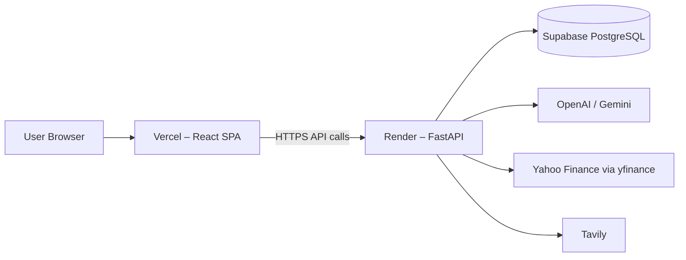

# InvestIQ Deployment Guide (Phase 7)

Deploy the **FastAPI backend** to [Render](https://render.com) and the **React frontend** to [Vercel](https://vercel.com).

InvestIQ is optimized for **Indian equities** (NSE/BSE via Yahoo Finance). Financial data does not require FMP for the MVP.



---

## Prerequisites

Before deploying, complete locally:

- [ ] Git repo pushed to **GitHub**
- [ ] API keys ready: **Gemini or OpenAI**, **Tavily**
- [ ] `YFINANCE_ENABLED=true` (default – no key required for financial data)
- [ ] **Supabase** project created + migration run (`backend/database/migrations/001_research_reports.sql`)
- [ ] One successful local report generation (e.g. `POST /api/v1/research/INFY/report`)
- [ ] `pytest` passing in `backend/`

---

## Configuration Overview

All backend environment variables are loaded through a single Pydantic Settings module:

```
backend/app/core/config.py
```

Template files:

| File | Purpose |
|------|---------|
| `backend/.env.example` | Local development template |
| `backend/.env.production.example` | Production reference for Render |

Import in code:

```python
from app.core.config import settings
```

On startup the backend logs app name, environment, debug mode, Chroma, and storage flags — **never API keys**.

---

## Part 1: Deploy Backend to Render

### Option A – Blueprint (recommended)

1. Push this repo to GitHub.
2. Go to [Render Dashboard](https://dashboard.render.com) → **New** → **Blueprint**.
3. Connect your GitHub repo. Render detects `render.yaml` at the repo root.
4. Review the service `investiq-api` and apply.
5. In the service **Environment** tab, set these **secrets**:

| Variable | Required | Value |
|----------|----------|--------|
| `GEMINI_API_KEY` | One LLM key required | Your Gemini key **or** use `OPENAI_API_KEY` below |
| `OPENAI_API_KEY` | One LLM key required | Your OpenAI key **or** use `GEMINI_API_KEY` above |
| `TAVILY_API_KEY` | Yes (full reports) | Your Tavily key |
| `SUPABASE_URL` | Yes (persistent storage) | `https://xxxx.supabase.co` (no `/rest/v1/`) |
| `SUPABASE_ANON_KEY` | Yes (persistent storage) | Supabase **anon** key from Project Settings → API |
| `CORS_ORIGINS` | Yes (after Vercel deploy) | `https://your-app.vercel.app` |

Optional:

| Variable | Default | Notes |
|----------|---------|-------|
| `YFINANCE_ENABLED` | `true` | Primary financial data source for Indian equities |
| `FMP_API_KEY` | — | Optional future provider; not required for MVP |
| `GEMINI_MODEL` | `gemini/gemini-2.0-flash` | Override if needed |
| `OPENAI_MODEL` | `gpt-4.1` | Override if needed |
| `LOG_LEVEL` | `INFO` | Startup logging verbosity |

6. Wait for deploy. Note your API URL, e.g. `https://investiq-api.onrender.com`.
7. Verify:

```bash
curl https://investiq-api.onrender.com/api/v1/health
curl https://investiq-api.onrender.com/api/v1/financials/INFY
```

### Option B – Manual Web Service

| Setting | Value |
|---------|--------|
| **Root Directory** | `backend` |
| **Runtime** | Python 3 |
| **Build Command** | `pip install -r requirements-prod.txt` |
| **Start Command** | `uvicorn app.main:app --host 0.0.0.0 --port $PORT` |
| **Health Check Path** | `/api/v1/health` |

Add the same environment variables as above.

### Option C – Docker

```bash
cd backend
docker build -t investiq-api .
docker run -p 8000:8000 --env-file .env.production.example investiq-api
```

Use the Dockerfile on Render by selecting **Docker** as runtime instead of Python.

---

## Part 2: Deploy Frontend to Vercel

1. Go to [Vercel Dashboard](https://vercel.com/dashboard) → **Add New** → **Project**.
2. Import your GitHub repo.
3. Configure:

| Setting | Value |
|---------|--------|
| **Framework Preset** | Vite |
| **Root Directory** | `frontend` |
| **Build Command** | `npm run build` |
| **Output Directory** | `dist` |

4. Add **Environment Variable**:

| Name | Value |
|------|--------|
| `VITE_API_URL` | `https://investiq-api.onrender.com/api/v1` |

Use your actual Render URL. **No trailing slash.**

5. Deploy. Note your frontend URL, e.g. `https://investiq.vercel.app`.

---

## Part 3: Connect Frontend ↔ Backend (CORS)

1. In **Render** → your API service → **Environment**, update:

```
CORS_ORIGINS=https://investiq.vercel.app,http://localhost:5173
```

Replace with your real Vercel URL. Multiple origins are comma-separated (parsed by `settings.cors_origins_list`).

2. **Redeploy** the Render service (or save env – Render auto-redeploys).

3. Open your Vercel URL → generate a test report for an Indian ticker (e.g. `INFY`).

---

## Production Environment Reference

See `backend/.env.production.example` for the full list.

| Variable | Production value | Why |
|----------|------------------|-----|
| `APP_ENV` | `production` | Enables production validation rules |
| `DEBUG` | `false` | Required when `APP_ENV=production`; hides `/docs` |
| `YFINANCE_ENABLED` | `true` | Yahoo Finance is the primary data provider |
| `CHROMA_ENABLED` | `false` on Render free | Disk is ephemeral; use Supabase for persistence |
| `STORAGE_ENABLED` | `true` | Save reports to Supabase |
| `CORS_ORIGINS` | Your Vercel URL | Browser security |
| `SUPABASE_ANON_KEY` | Anon key | Backend storage via PostgREST |

> **Note:** `SUPABASE_KEY` is supported as a legacy alias but `SUPABASE_ANON_KEY` is preferred. Never expose Supabase keys in the frontend.

---

## Important: Request Timeouts

Full AI reports (`POST /research/{ticker}/report`) can take **1–3 minutes**.

| Platform | Limit | Impact |
|----------|-------|--------|
| Render Free | ~30s request timeout | Report generation may **fail** |
| Render Paid | Longer timeouts | Works better |
| Vercel | Serverless N/A | Frontend only – fine |

**Workarounds if reports timeout on Render Free:**

1. Upgrade Render plan for longer timeouts.
2. Use locally for full reports; deploy API for data/history endpoints only.
3. (Future) Add background job queue (Celery + Redis).

These endpoints work reliably on the free tier:

| Endpoint | Example |
|----------|---------|
| `GET /api/v1/health` | Health check |
| `GET /api/v1/financials/INFY` | Compact Indian equity snapshot |
| `POST /api/v1/research/INFY` | Full structured financial data |
| `GET /api/v1/reports` | Saved report history |

---

## Verification Checklist

After both deploys:

- [ ] `GET https://your-api.onrender.com/api/v1/health` → `{"status":"ok"}`
- [ ] `GET https://your-api.onrender.com/api/v1/financials/INFY` → JSON with `ticker: "INFY.NS"`
- [ ] Vercel site loads
- [ ] Browser DevTools → Network: API calls go to Render URL (not localhost)
- [ ] Generate report for `INFY` or `RELIANCE` (or check History if Supabase has data)
- [ ] No CORS errors in browser console
- [ ] Restart Render service → reports still in History (Supabase persistence)

### Common issues

| Symptom | Fix |
|---------|-----|
| CORS error in browser | Add Vercel URL to `CORS_ORIGINS` on Render |
| `503 YFINANCE_ENABLED` | Set `YFINANCE_ENABLED=true` on Render |
| `503 OPENAI_API_KEY` / `GEMINI_API_KEY` | Set one LLM key on Render |
| `503 TAVILY_API_KEY` | Set Tavily key on Render |
| Frontend calls localhost | Set `VITE_API_URL` on Vercel, redeploy frontend |
| Reports not in History | Set `SUPABASE_URL` + `SUPABASE_ANON_KEY`; `STORAGE_ENABLED=true` |
| Supabase connection fails | Use base URL without `/rest/v1/`; run migration SQL |
| Report times out | Render free tier limit – see above |
| `DEBUG must be false` on deploy | Set `APP_ENV=production` and `DEBUG=false` |

---

## Custom Domains (optional)

- **Vercel:** Project → Settings → Domains
- **Render:** Service → Settings → Custom Domains

Update `CORS_ORIGINS` and `VITE_API_URL` to match your custom domains.

---

## CI / GitHub Actions (optional next step)

Not included in Phase 7. Typical setup:

- Push to `main` → Vercel auto-deploys frontend
- Push to `main` → Render auto-deploys backend
- Both platforms support this when connected to GitHub.

---

## Security Reminders

- Never commit `.env` files (listed in `.gitignore`)
- Use `SUPABASE_ANON_KEY` on the backend only — never in the frontend
- Rotate keys if exposed in chat or logs
- Consider Supabase Row Level Security before making the app public
- Production config rejects `DEBUG=true` when `APP_ENV=production`

---

## Quick Reference URLs

After deployment, save these:

```
Frontend:  https://____________.vercel.app
Backend:   https://____________.onrender.com
Health:    https://____________.onrender.com/api/v1/health
Financial: https://____________.onrender.com/api/v1/financials/INFY
API Docs:  (disabled in production – use local DEBUG=true)
Supabase:  https://app.supabase.com/project/____________
Config:    backend/app/core/config.py
```
